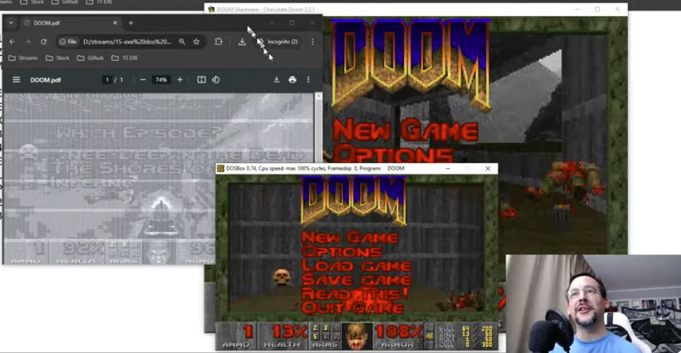

A PDF, PE and EXE polyglot executable running Doom

# What

It's using Doom Shareware, but in practice,
the same tricks should work for most arbitrary PE, EXE and JavaScript payloads.

This is a polyglot construction made of
Robert Xiao's [Universal Doom](https://github.com/nneonneo/universal-doom)
and
Allen Ading's [Doom.PDF](https://github.com/ading2210/doompdf)
to make a Doom executable that works as PDF, DOS Executable and PE executable.

The PDF payload only works under Chrome.

# How

Steps:
1. Abuse the gap between EXE header (until `0x1B`) and
the offset to PE header (at `0x3C`) to insert a PDF signature `%PDF-1.x`
and a stream object declaration to make the file identified as PDF
and hide all the Doom executable contents. Note that there's no room for the `/Length` declaration in the stream object parameters.

2. At the end of the EXE/PE body, close the stream object and add the rest of the `Doom.pdf` file.

This file will not work, as Chrome is having a hard time to locate the other objects without a declared length for the first stream object.

3. Recreate a working `XREF` table and `startxref` pointer, and update the `/Size` of the `trailer`. Voilà !

# More?

Check my livestreams [playlist](https://www.youtube.com/playlist?list=PL2-EpKoPE60Vh6z5zUOn6KRxB55NitlJf)
for more info about:
- PDF basics
- PDF parasites
- PDF polyglots
- JavaScript in PDF
- Doom PDF
- .COM programs
- .EXE programs: includes PE/EXE payloads, and crafting this PDF.
